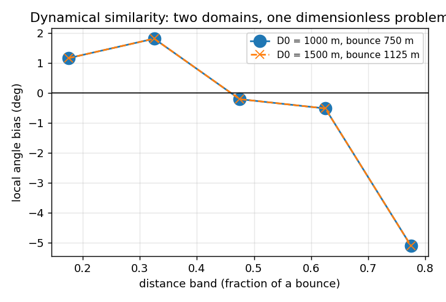
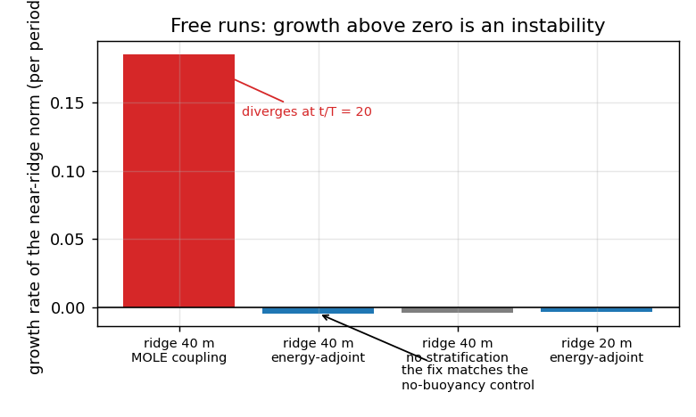
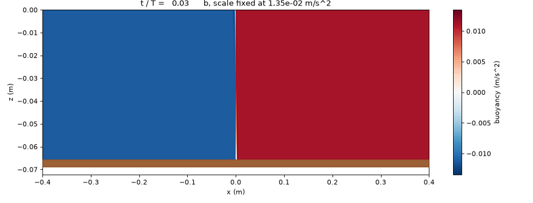
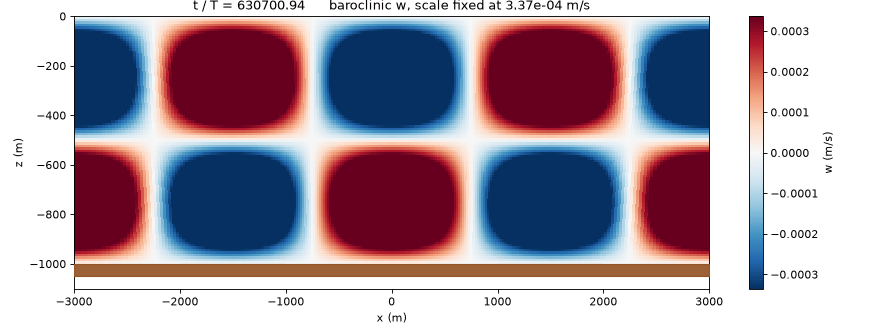
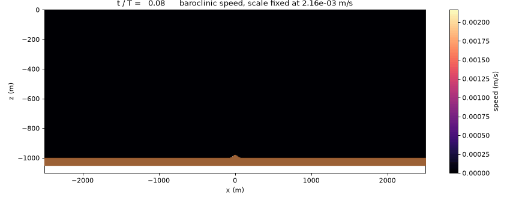
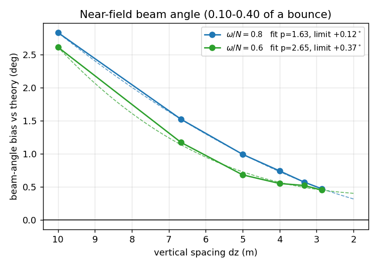
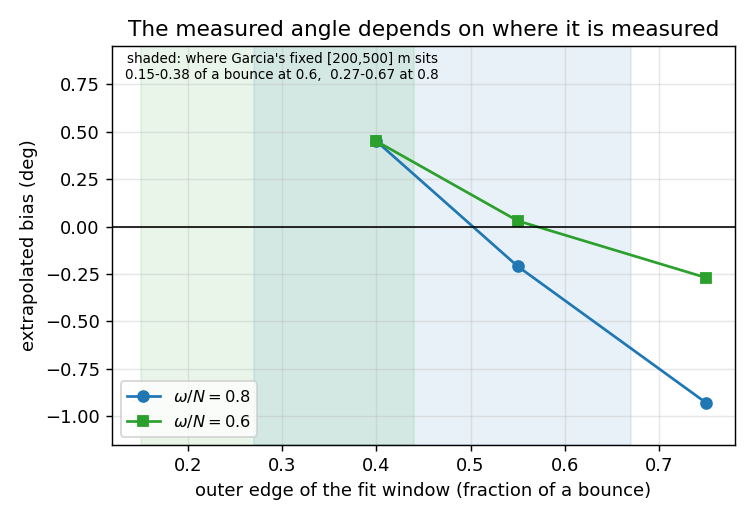
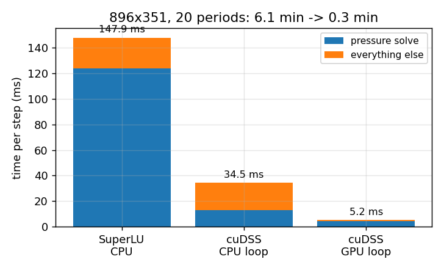

# gccom-mole-experiments

[](https://doi.org/10.5281/zenodo.22884121)

Verification and validation of a two-dimensional, non-hydrostatic, Boussinesq
internal-wave solver on **fully curvilinear grids**, built on the
[MOLE](https://github.com/csrc-sdsu/mole) mimetic operator library. It is a
testbed for reviving the mimetic formulation of the General Curvilinear Coastal
Ocean Model (GCCOM), and its validation target is the internal-wave-beam
benchmark of Garcia et al. (2019), *J. Comput. Sci.* 30:143–156, §3.3.

The solver (`iwbcurv.py`) is **linear**: there is no advection term, so every
result scales with the forcing amplitude.

## Status (v1.2.0)

| | status |
|---|---|
| Core discretization | **Verified.** Second order against the exact seiche dispersion relation |
| Dynamical similarity | **Verified.** Two domains at different depths give identical dimensionless results |
| Lateral boundary parameter `alpha` | **Fixed.** The old default dominated the error; now `1e-6` |
| Start-up transient | **Fixed.** A smooth forcing ramp (`--ramp 3`); settled by ~15 periods |
| Energy leak at a sloping bed | **Fixed.** `--buoy energy`; confirmed against a no-stratification control |
| Beam angle, near field | **Converges to theory**: +0.12° at ω/N = 0.8, +0.37° at 0.6 |
| Disagreement with the published Fig 9 | **Explained**: a fit window fixed in metres samples different parts of the beam |
| Speed | 28× faster per run with cuDSS on the GPU |

## 1. The core discretization is verified

A free standing internal wave (`--seiche I J`) in a flat rectangular box — on a
grid that is still curvilinear — has the exact frequency
ω = N k / √(k² + p²). The solver converges to it at **second order**:


| grid | dz (m) | relative frequency error | local order |
|---|---|---|---|
| 128×51 | 20.00 | −1.8100e-03 | |
| 192×76 | 13.33 | −7.7169e-04 | 2.10 |
| 256×101 | 10.00 | −4.0843e-04 | 2.21 |
| 384×151 | 6.67 | −1.4903e-04 | 2.49 |

**Dynamical similarity.** Two domains that differ in depth by 1.5× but match in
every dimensionless group (`ab/D0`, `Lb/D0`, `Lx/D0`, cells per bounce) give
results identical to two decimals in every distance band, and the same
beam-angle bias:



## 2. Three defects, found and fixed

**The lateral Robin coefficient.** `alpha` only regularises an otherwise
singular pure-Neumann problem at the side walls. At the old default `1e-4` it
dominated the seiche error, which *grew* under refinement. Below about `1e-6`
the error plateaus at its true discretization value.


**The start-up transient.** The tide used to switch on abruptly, kicking the
domain with a broadband transient that rings down slowly — and more slowly on
finer grids, which is the kind of error that can fake a convergence trend.
`--ramp 3` brings the forcing on over three periods; the field is then settled
by ~15 periods.


**An energy leak at a sloping bed.** On fine grids over a steeper ridge, a
spurious mode grew at the crest and radiated beams at a frequency nobody was
forcing (~0.37 N, a shallow ~22° angle), eventually diverging:


Ablation located it: the growth was independent of the time step, of `alpha`, of
the operator order and of the grid stretching, but **vanished with `--N 0`** —
so it lived in the buoyancy coupling. The cause is a one-way exchange at the
boundary. MOLE's interpolator pair is not adjoint there: the bed face takes its
buoyancy from the boundary point alone, while the first interior cell takes half
of *its* forcing from the bed face. On a flat bottom `w_bed = 0` and the term
vanishes — which is why the seiche never saw it — but over a slope
`w_bed = slope · u`, and energy enters at the ridge.

`--buoy energy` rebuilds the w-forcing as the exact adjoint of `Idf_w` in the
physical-area inner product (row sums exactly 1, adjoint to ~1e-15). Free runs,
no tide, so any growth is the instability:



The fixed solver decays at the same rate as one with no buoyancy coupling at
all, which is as complete as this test can show. A 20 m ridge that used to
diverge at period 79 now runs 150 periods cleanly.

## Validation, animated

The three cases the solver is verified against, run with nonlinear advection
(`--advect full`, second-order upwinding):

| | |
|---|---|
| **Lock release.** The interface collapses into a gravity current and Kelvin-Helmholtz billows roll up along it. Front speed Fr = 0.69 against the inviscid 0.7071 and the 2021 mimetic GCCOM's 0.705. |  |
| **Seiche.** A standing internal wave in a flat box, the case with an exact frequency. At small amplitude the nonlinear code reproduces the linear result to 0.04%. |  |
| **Internal-wave beam.** Radiation from a ridge under tidal forcing — the experiment the 2021 mimetic GCCOM could not sustain. Steady for 25 periods at 53.55 deg against 53.13 deg theory. |  |

Rebuild them with `animate3.ps1` (runs and frames) then `animate_web.ps1`
(sizes for the web). The solver writes frames with `--frames DIR`; `animate.py`
renders any of buoyancy, vertical velocity, horizontal velocity or speed.

## 3. Beam angle

Measured with the perpendicular-slice energy centroid over 0.10–0.40 of a
bounce, with all three fixes in place, six grids per frequency:



| grid | 256×101 | 384×151 | 512×201 | 640×251 | 768×301 | 896×351 | limit |
|---|---|---|---|---|---|---|---|
| ω/N = 0.8 | +2.83 | +1.52 | +0.99 | +0.74 | +0.57 | +0.47 | **+0.12°** (p = 1.63) |
| ω/N = 0.6 | +2.61 | +1.17 | +0.68 | +0.55 | +0.52 | +0.45 | **+0.37°** (p = 2.65) |

**Why the published comparison disagrees.** The measured angle depends on where
along the beam it is fitted, because beyond about half a bounce the beam
approaches the surface and overlaps its own reflection:



Garcia et al. fit over a window fixed in metres, `[200,500]`. That is 0.15–0.38
of a bounce at ω/N = 0.6 — the clean near field — but 0.27–0.67 at ω/N = 0.8,
reaching into the contaminated region. In their own window this solver gives
+0.37° at 0.6 and −1.39° at 0.8; over a consistent fraction of a bounce it
gives +0.37° and +0.12°. The disagreement is the convention, not the model.

**Measurement.** `centroid_track.py` tracks the beam by the energy-weighted
centroid on slices perpendicular to the theory direction, which is far more
stable than the column-wise maximum (linear-fit residuals 2.4 m against 3.3 m,
and the argmax series cannot be extrapolated at all). Windows are stated as
fractions of a bounce, D₀/tan θ.

## 4. Speed



| | solve | everything else | per step | 20-period run at 896×351 |
|---|---|---|---|---|
| SuperLU, CPU | 124 ms | 23.9 ms | 147.9 ms | 6.1 min |
| cuDSS, CPU loop | 13.1 | 21.4 | 34.6 ms | 1.4 min |
| **cuDSS, GPU loop** | **4.4** | **0.8** | **5.2 ms** | **0.3 min** |

`--device gpu` keeps every field and operator on the card, so nothing crosses
the PCIe bus per step. Saved fields match the CPU run to ~1e-13, and the seiche
reproduces its CPU value exactly. Benchmarked against the alternatives on the
real pressure matrix (`solver_bench.py`): cuDSS is 25× faster per solve than
SuperLU at the same 3e-16 residual, while CuPy's CPU-factor/GPU-solve route is
30× *slower* and its single-precision variant loses too much accuracy to use.
A grid/operator cache removes the ~3 min of Octave grid generation per run.

## MOLE fixes arising from this work

| issue | pull request | subject |
|---|---|---|
| csrc-sdsu/mole#453 | #466 | `GI13` index map — `grad3DCurv` did not converge on curvilinear grids |
| csrc-sdsu/mole#454 | #468 | warn when the grid handed to the curvilinear operators is left-handed |
| csrc-sdsu/mole#455 | #469 | `ttm` initial guess — elliptic grids came out folded |
| csrc-sdsu/mole#456 | — | orientation guard for 3-D and vanishing Jacobians |

The 2-D results here use **stock MOLE**: none of those code paths is exercised
by `iwbcurv.py`. The buoyancy-coupling defect in §2 is not in a MOLE operator —
`interpol2D` and `interpolD2D` are each correct — but in how the pair is used
together at a sloping boundary.

## Reproducing

MOLE at commit `1d009d14` (the `mole` submodule), GNU Octave 8.4, Python
3.11–3.12, numpy, scipy, oct2py; optionally pypardiso, and cupy + nvmath-python
for the GPU path.

```powershell
git clone --recurse-submodules https://github.com/manuelvalera/gccom-mole-experiments.git
cd gccom-mole-experiments
$env:MOLE_SRC = "$PWD\mole\src\octave"        # src\octave, not src\matlab_octave
.\preflight_bulge.ps1                          # grid files must honour --bulge
.\validate.ps1                                 # sections A-C: ~15 min on a GPU
python centroid_track.py val-npz
```

| flag | purpose |
|---|---|
| `--ramp N` | bring the tide on smoothly over N periods |
| `--buoy energy` | energy-consistent buoyancy coupling (§2) |
| `--solver cudss --device gpu` | GPU factorization and an all-GPU time loop |
| `--solver pardiso` | multithreaded CPU solver (`MKL_NUM_THREADS=4` was fastest here) |
| `--u0 0 --noise A --probe` | free run and growth-rate report — any growth is an instability |
| `--cache DIR`, `--no-cache` | grid/operator cache |

| study | scripts |
|---|---|
| everything, in order | `validate.ps1` |
| seiche verification | `seiche_study.ps1`, `seiche_alpha.ps1`, `seiche_report.py` |
| run length and the ramp | `time_test.ps1`, `ramp_test.ps1`, `time_compare.py` |
| beam measurement | `centroid_track.py`, `refit.py`, `curvature.py`, `crest_check.py` |
| the instability | `reproducer.ps1`, `ablate.ps1`, `instab_test.ps1` |
| similarity | `reflect_test.ps1` |
| performance | `solver_bench.py`, `speed_check.ps1`, `gpu_check.ps1`, `gpu_bench.ps1` |

Saved fields (`*.npz`) and the cache are not tracked; the scripts regenerate
them. Run logs are included. Code style: one statement per line, see
`STYLE.md` and `style_check.py`.

## Citation

Cite the concept DOI, which always resolves to the latest version:
[10.5281/zenodo.22884121](https://doi.org/10.5281/zenodo.22884121). Individual
versions: v1.0.1 [10.5281/zenodo.22884885](https://doi.org/10.5281/zenodo.22884885).
See also `CITATION.cff`.

Please also cite Garcia et al. (2019) for the benchmark and the MOLE JOSS paper
(Corbino, Dumett & Castillo, 2024) for the operator library.

## License

GPL-3.0-or-later, matching MOLE.
