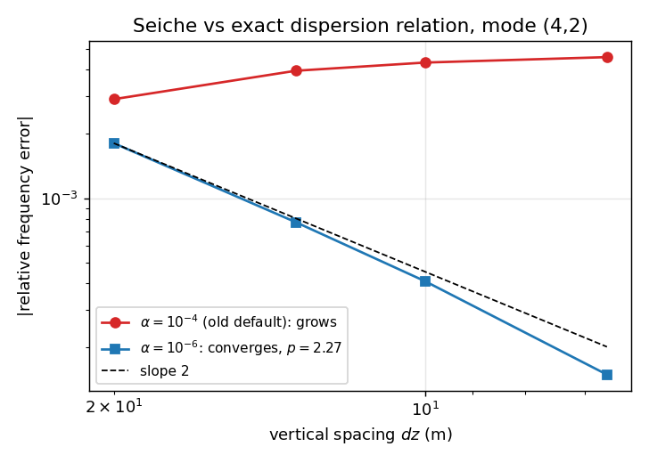
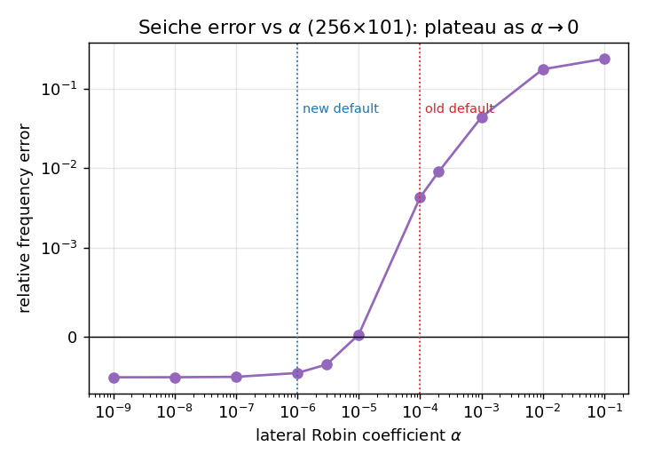
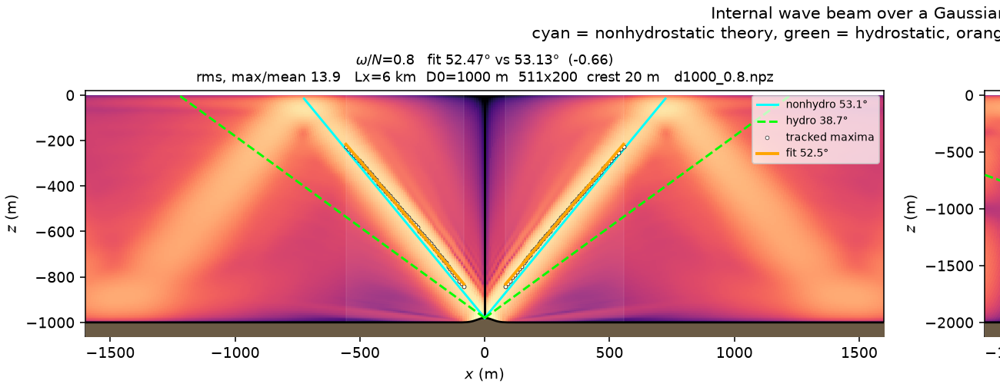
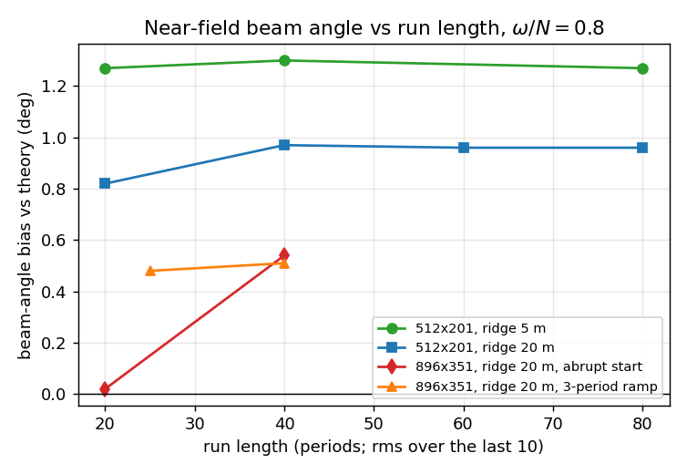
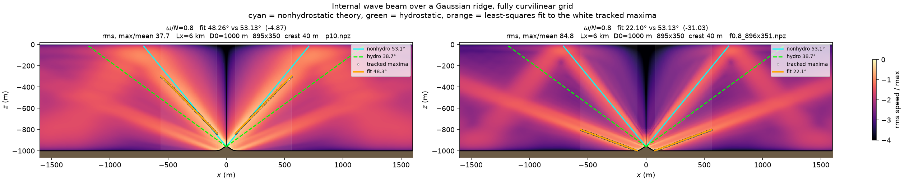
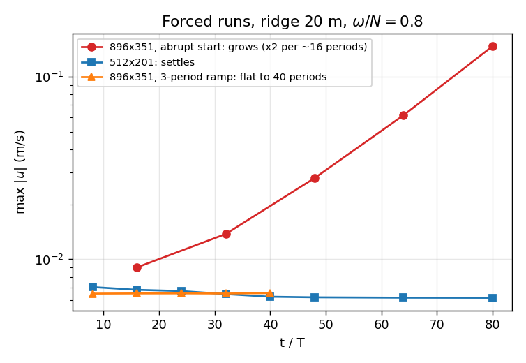

# gccom-mole-experiments

[](https://doi.org/10.5281/zenodo.22884121)

Verification and validation of a two-dimensional, non-hydrostatic, Boussinesq
internal-wave solver on **fully curvilinear grids**, built on the
[MOLE](https://github.com/csrc-sdsu/mole) mimetic operator library. It is a
testbed for reviving the mimetic formulation of the General Curvilinear Coastal
Ocean Model (GCCOM), and its validation target is the internal-wave-beam
benchmark of Garcia et al. (2019), *J. Comput. Sci.* 30:143–156, §3.3.

The solver (`iwbcurv.py`) is **linear**: there is no advection term, so every
result scales with the forcing amplitude.

## Status at a glance (v1.1.0, work in progress)

| | status |
|---|---|
| Core discretization | **Verified.** Seiche converges at second order to the exact dispersion relation |
| Lateral boundary parameter `alpha` | **Resolved.** The old default dominated the error; new default `1e-6` |
| Beam angle, near field | Measurable and robust once spun up; settled values within ~1° of theory |
| Beam-angle grid convergence | **Being re-measured.** Earlier 20-period results were not converged in time |
| Start-up transient | **Resolved** with a smooth forcing ramp (`--ramp 3`) |
| Numerical instability near steeper topography on fine grids | **Open.** Reproduced cheaply; source being isolated |
| Speed | Grid/operator cache and PARDISO solver: ~2× faster per run |

## 1. The core discretization is verified

A free standing internal wave (`--seiche I J`) in a flat rectangular box — on a
grid that is still curvilinear — has an exact frequency
ω = N k / √(k² + p²). Once the lateral boundary coefficient is small enough, the
solver converges to it at **second order**:



| grid | dz (m) | relative frequency error | local order |
|---|---|---|---|
| 128×51 | 20.00 | −1.81e-03 | |
| 192×76 | 13.33 | −7.72e-04 | 2.10 |
| 256×101 | 10.00 | −4.08e-04 | 2.21 |
| 384×151 | 6.67 | −1.49e-04 | 2.49 |

Mode (4,2), time step converged (the scheme is second order in time). A fit of
e = A·dzᵖ + e₀ with p = 2 leaves a residual of 7.8e-08 with e₀ = +5.9e-05.

**The lateral Robin coefficient.** `alpha` only regularises an otherwise
singular pure-Neumann Poisson problem at the side walls. At the former default
`1e-4` it dominated the error, which *grew* under refinement (red above). As
`alpha → 0` the error plateaus at its true discretization value, and `1e-6` sits
safely on that plateau while keeping the factorization well conditioned:



## 2. Beam angle: what holds and what is being re-measured

A clean beam at ω/N = 0.8 over a 20 m ridge (512×201):



**Spin-up.** Every run averages the field over its last 10 periods. The tide
used to be switched on abruptly, which kicks the domain with a broadband
transient; it rings down slowly, and more slowly on finer grids. Measured
near-field bias (perpendicular-slice energy centroid, 0.10–0.40 of a bounce):



On 512×201 the value is settled by 40 periods. On 896×351 it moved +0.52° between
20 and 40 periods. With a three-period ramp (`--ramp 3`) it is settled by ~15–25
periods and agrees with the long unramped value.

**Consequence.** The earlier grid-convergence study (six grids, reported in
v1.0.x as first-order convergence to about −1° at ω/N = 0.8) was measured on
20-period runs, whose spin-up error grows with resolution — exactly the kind of
error that can fake a convergence trend. It is **withdrawn pending
re-measurement** with the ramp. The two settled values available so far, +0.96°
at 512×201 and +0.51° at 896×351, extrapolate to between about 0.0° and +0.3° —
suggestive, not yet a result.

Two other v1.0.x observations were also largely spin-up artifacts: the
apparent curvature of the beam, and the strong dependence of the measured angle
on the fit window (once settled, near and long windows agree to ~0.25°). The
conceptual point stands that a fit window fixed in metres, as in Garcia et al.,
samples different fractions of a bounce at different frequencies.

**Measurement.** The beam is tracked by the energy-weighted centroid on slices
perpendicular to the theory direction (`centroid_track.py`), which is more
stable than the column-wise maximum. Windows are stated as fractions of a
bounce, D₀ / tan θ.

## 3. Open: a numerical instability near steeper topography

On fine grids a spurious mode grows at the ridge crest and radiates beams at a
frequency nobody is forcing (~0.37 N, a shallow ~22° angle). It is well developed
at 10 periods and dominant by 20 (40 m ridge, 896×351):



What is established:

- It **grows without bound**: max/mean 38 → 85 between 10 and 20 periods, and the
  40-period run diverged at t/T = 20.3.
- It is **independent of the time step** (identical at 60, 120 and 240 steps per
  period), so it is a property of the spatial discretization, not a
  time-stepping limit.
- It needs **both steeper topography and finer resolution**. With a 20 m ridge
  it is absent at 512×201 (stable to 80 periods) but present at 896×351, where
  an abrupt start seeds it strongly enough to double every ~16 periods:



- A **narrow replica** (Lx = 1.5 km with the same resolution around the ridge)
  reproduces it in two minutes instead of twenty.
- It cannot come from the lagged pressure gradient of the incremental
  projection: that term is a pure gradient, which an exact projection removes.

With `--ramp 3`, periods ~15–25 give a clean measurement window before it
matters, which is what the current beam-angle numbers use. That is a documented
workaround, not a fix. An ablation study on the replica — switching off
stratification, varying the boundary coefficient, operator order, sponge and
grid skewness one at a time — is in progress to locate the unstable coupling.
This matters beyond the benchmark: steep topography is exactly the Monterey Bay
regime this solver is meant for.

## 4. Performance

A profile at 896×351 showed ~200 s of Octave grid generation per run and the
pressure solve at ~83% of the time loop.

| change | effect |
|---|---|
| grid/operator cache (`.gridcache/`) | 4.4 → 1.2 min for a short run; ~3 min saved on every run |
| `--solver pardiso`, 4 threads | 157 → 122 ms per step; more threads are slower (bandwidth-bound) |

PARDISO reproduces the seiche result exactly (−4.0844e-04) and every beam angle
to the printed digit. The cache key covers grid size, geometry, stretching and a
hash of all MOLE and grid-definition `.m` files, so any change forces a rebuild.

## MOLE fixes arising from this work

| issue | pull request | subject |
|---|---|---|
| csrc-sdsu/mole#453 | #466 | `GI13` index map — `grad3DCurv` did not converge on curvilinear grids |
| csrc-sdsu/mole#454 | #468 | warn when the grid handed to the curvilinear operators is left-handed |
| csrc-sdsu/mole#455 | #469 | `ttm` initial guess — elliptic grids came out folded |
| csrc-sdsu/mole#456 | — | orientation guard for 3-D and vanishing Jacobians |

The 2-D results here use **stock MOLE**: none of those code paths (`GI13`,
`ttm`, the 3-D Jacobian) is exercised by `iwbcurv.py`.

## Reproducing

Environment: MOLE at commit `1d009d14` (the `mole` submodule), GNU Octave 8.4,
Python 3.11–3.12, numpy 2.4, scipy 1.17, oct2py, and optionally pypardiso.

```powershell
git clone --recurse-submodules https://github.com/manuelvalera/gccom-mole-experiments.git
cd gccom-mole-experiments
$env:MOLE_SRC = "$PWD\mole\src\octave"        # src\octave, not src\matlab_octave
$env:MKL_NUM_THREADS = "4"                     # best PARDISO setting measured
.\preflight_bulge.ps1                          # grid files must honour --bulge
```

New solver options:

| flag | purpose |
|---|---|
| `--ramp N` | bring the tide on smoothly over N periods (0 = abrupt, the old behaviour) |
| `--solver pardiso` | multithreaded MKL PARDISO instead of SuperLU |
| `--cache DIR`, `--no-cache` | grid/operator cache location, or bypass it |
| `--u0 0 --noise A` | free run from a small random field — any growth is an instability |
| `--probe` | log norms every period (whole domain and near the ridge) and fit the growth rate |
| `--save-matrix F` | write the pressure matrix for solver benchmarking |

| study | scripts |
|---|---|
| seiche verification | `seiche_study.ps1`, `seiche_alpha.ps1`, `seiche_report.py` |
| run-length convergence | `time_test.ps1`, `ramp_test.ps1`, `time_compare.py` |
| beam measurement | `centroid_track.py`, `refit.py`, `curvature.py`, `crest_check.py` |
| instability | `instab_test.ps1`, `instab2.ps1`, `reproducer.ps1`, `ablate.ps1` |
| performance | `speed_check.ps1` |

Saved fields (`*.npz`) and the cache are not tracked in git; the scripts
regenerate them. Run logs are included.

## Citation

Cite the concept DOI, which always resolves to the latest version:
[10.5281/zenodo.22884121](https://doi.org/10.5281/zenodo.22884121). Individual
versions: v1.0.1 [10.5281/zenodo.22884885](https://doi.org/10.5281/zenodo.22884885).
See also `CITATION.cff`.

Please also cite Garcia et al. (2019) for the benchmark and the MOLE JOSS paper
(Corbino, Dumett & Castillo, 2024) for the operator library.

## License

GPL-3.0-or-later, matching MOLE.
