# gccom-mole-experiments

[](https://doi.org/10.5281/zenodo.22884121)

Verification and validation of a two-dimensional, non-hydrostatic, Boussinesq
internal-wave solver on **fully curvilinear grids**, built on the
[MOLE](https://github.com/csrc-sdsu/mole) mimetic operator library. It is a
testbed for reviving the mimetic formulation of the General Curvilinear Coastal
Ocean Model (GCCOM), and its validation target is the internal-wave-beam
benchmark of Garcia et al. (2019), *J. Comput. Sci.* 30:143–156, §3.3.

The solver (`iwbcurv.py`) was built linear and verified that way first; every
section below marked *linear* used `--advect none`, which remains the default
and is bit-identical to those results. Nonlinear advection, rotation, viscosity
and mode-1 boundary forcing were added afterwards, each verified in isolation,
and are used in the last two sections to reproduce the nearshore internal bores
of Walter et al. (2012) on the measured Monterey Bay transect.

## Status (v1.3.0, in progress)

| | status |
|---|---|
| Nonlinear advection | **Verified.** Machine-precision exact cases; second order on stretched grids; lock release Fr = 0.699 against 0.705 published (§5) |
| Rotation | **Verified.** Rotating seiche matches the exact dispersion relation at every latitude, same error as without rotation |
| Nonlinear internal-wave beam | **Runs.** 25 periods, steady, 53.55° against 53.13° — the case the 2021 mimetic GCCOM could not sustain |
| Nearshore bores, Monterey Bay | **Both regimes reproduced** on Walter et al.'s bathymetries at their resolution: non-canonical on the steep step, canonical on the gentle slope; the warm return is slower than theirs (§6) |
| Core discretization | **Verified.** Second order against the exact seiche dispersion relation |
| Dynamical similarity | **Verified.** Two domains at different depths give identical dimensionless results |
| Lateral boundary parameter `alpha` | **Fixed.** The old default dominated the error; now `1e-6` |
| Start-up transient | **Fixed.** A smooth forcing ramp (`--ramp 3`); settled by ~15 periods |
| Energy leak at a sloping bed | **Fixed.** `--buoy energy`; confirmed against a no-stratification control |
| Beam angle, near field | **Converges to theory**: +0.12° at ω/N = 0.8, +0.37° at 0.6 |
| Disagreement with the published Fig 9 | **Explained**: a fit window fixed in metres samples different parts of the beam |
| Speed | 28× faster per run with cuDSS on the GPU |

## 1. The core discretization is verified

A free standing internal wave (`--seiche I J`) in a flat rectangular box — on a
grid that is still curvilinear — has the exact frequency
ω = N k / √(k² + p²). The solver converges to it at **second order**:

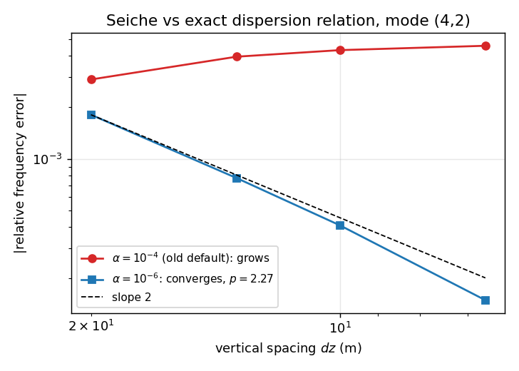

| grid | dz (m) | relative frequency error | local order |
|---|---|---|---|
| 128×51 | 20.00 | −1.8100e-03 | |
| 192×76 | 13.33 | −7.7169e-04 | 2.10 |
| 256×101 | 10.00 | −4.0843e-04 | 2.21 |
| 384×151 | 6.67 | −1.4903e-04 | 2.49 |

**Dynamical similarity.** Two domains that differ in depth by 1.5× but match in
every dimensionless group (`ab/D0`, `Lb/D0`, `Lx/D0`, cells per bounce) give
results identical to two decimals in every distance band, and the same
beam-angle bias:

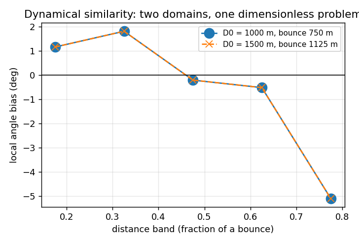

## 2. Three defects, found and fixed

**The lateral Robin coefficient.** `alpha` only regularises an otherwise
singular pure-Neumann problem at the side walls. At the old default `1e-4` it
dominated the seiche error, which *grew* under refinement. Below about `1e-6`
the error plateaus at its true discretization value.

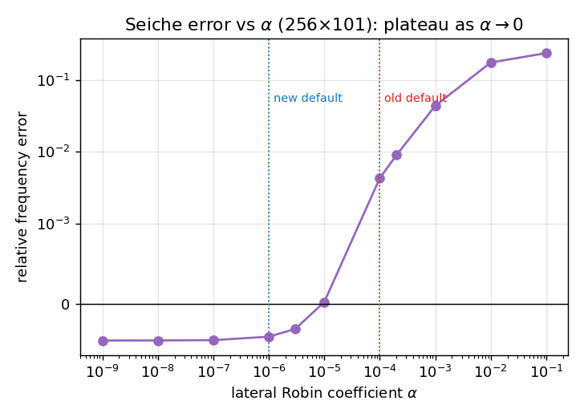

**The start-up transient.** The tide used to switch on abruptly, kicking the
domain with a broadband transient that rings down slowly — and more slowly on
finer grids, which is the kind of error that can fake a convergence trend.
`--ramp 3` brings the forcing on over three periods; the field is then settled
by ~15 periods.

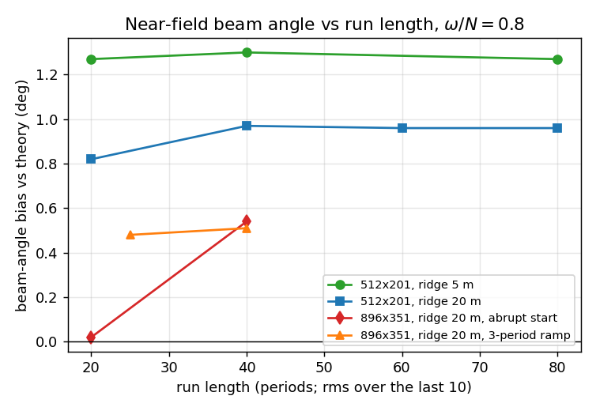

**An energy leak at a sloping bed.** On fine grids over a steeper ridge, a
spurious mode grew at the crest and radiated beams at a frequency nobody was
forcing (~0.37 N, a shallow ~22° angle), eventually diverging:

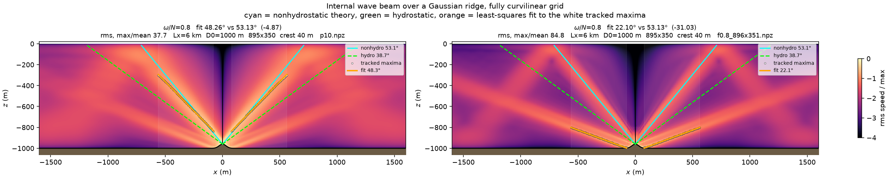

Ablation located it: the growth was independent of the time step, of `alpha`, of
the operator order and of the grid stretching, but **vanished with `--N 0`** —
so it lived in the buoyancy coupling. The cause is a one-way exchange at the
boundary. MOLE's interpolator pair is not adjoint there: the bed face takes its
buoyancy from the boundary point alone, while the first interior cell takes half
of *its* forcing from the bed face. On a flat bottom `w_bed = 0` and the term
vanishes — which is why the seiche never saw it — but over a slope
`w_bed = slope · u`, and energy enters at the ridge.

`--buoy energy` rebuilds the w-forcing as the exact adjoint of `Idf_w` in the
physical-area inner product (row sums exactly 1, adjoint to ~1e-15). Free runs,
no tide, so any growth is the instability:

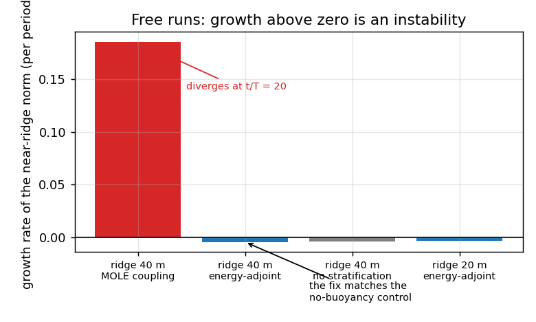

The fixed solver decays at the same rate as one with no buoyancy coupling at
all, which is as complete as this test can show. A 20 m ridge that used to
diverge at period 79 now runs 150 periods cleanly.

## Validation, animated

The three cases the solver is verified against, run with nonlinear advection
(`--advect full`, second-order upwinding):

| | |
|---|---|
| **Lock release.** The interface collapses into a gravity current and Kelvin-Helmholtz billows roll up along it. Front speed Fr = 0.69 against the inviscid 0.7071 and the 2021 mimetic GCCOM's 0.705. | 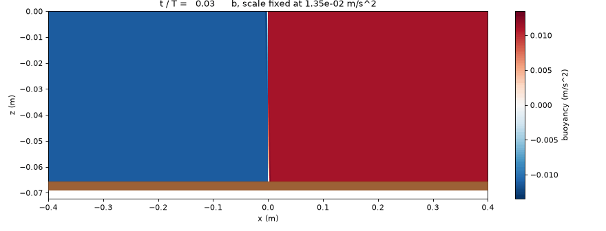 |
| **Seiche.** A standing internal wave in a flat box, the case with an exact frequency. At small amplitude the nonlinear code reproduces the linear result to 0.04%. | 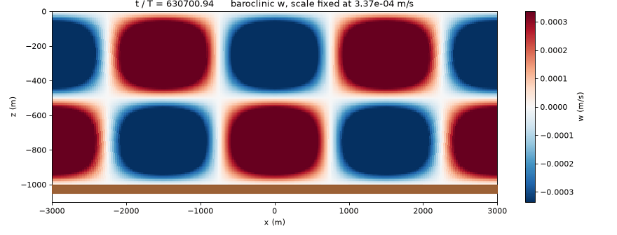 |
| **Internal-wave beam.** Radiation from a ridge under tidal forcing — the experiment the 2021 mimetic GCCOM could not sustain. Steady for 25 periods at 53.55 deg against 53.13 deg theory. | 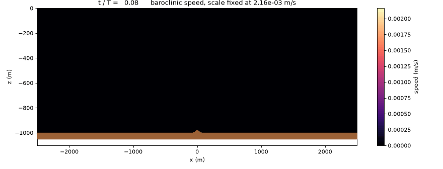 |

Rebuild them with `animate3.ps1` (runs and frames) then `animate_web.ps1`
(sizes for the web). The solver writes frames with `--frames DIR`; `animate.py`
renders any of buoyancy, vertical velocity, horizontal velocity or speed.

## 3. Beam angle

Measured with the perpendicular-slice energy centroid over 0.10–0.40 of a
bounce, with all three fixes in place, six grids per frequency:

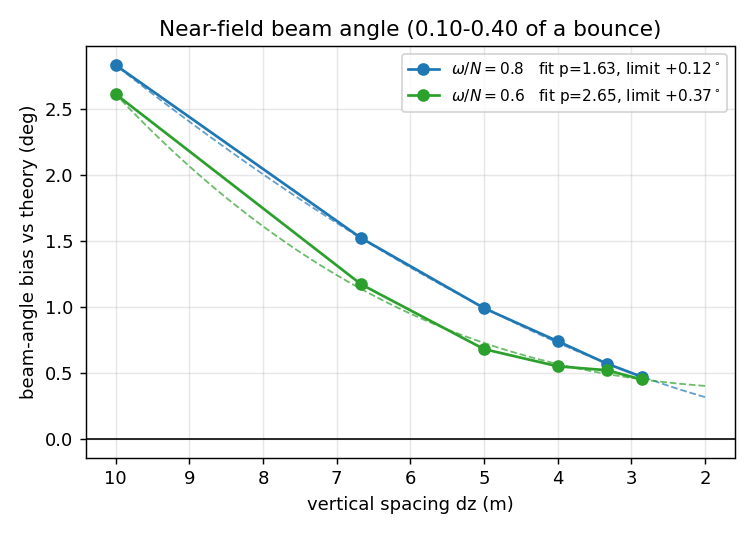

| grid | 256×101 | 384×151 | 512×201 | 640×251 | 768×301 | 896×351 | limit |
|---|---|---|---|---|---|---|---|
| ω/N = 0.8 | +2.83 | +1.52 | +0.99 | +0.74 | +0.57 | +0.47 | **+0.12°** (p = 1.63) |
| ω/N = 0.6 | +2.61 | +1.17 | +0.68 | +0.55 | +0.52 | +0.45 | **+0.37°** (p = 2.65) |

**Why the published comparison disagrees.** The measured angle depends on where
along the beam it is fitted, because beyond about half a bounce the beam
approaches the surface and overlaps its own reflection:

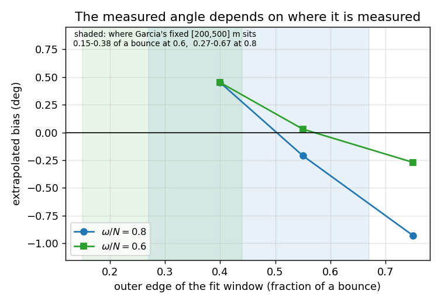

Garcia et al. fit over a window fixed in metres, `[200,500]`. That is 0.15–0.38
of a bounce at ω/N = 0.6 — the clean near field — but 0.27–0.67 at ω/N = 0.8,
reaching into the contaminated region. In their own window this solver gives
+0.37° at 0.6 and −1.39° at 0.8; over a consistent fraction of a bounce it
gives +0.37° and +0.12°. The disagreement is the convention, not the model.

**Measurement.** `centroid_track.py` tracks the beam by the energy-weighted
centroid on slices perpendicular to the theory direction, which is far more
stable than the column-wise maximum (linear-fit residuals 2.4 m against 3.3 m,
and the argmax series cannot be extrapolated at all). Windows are stated as
fractions of a bounce, D₀/tan θ.

## 4. Speed

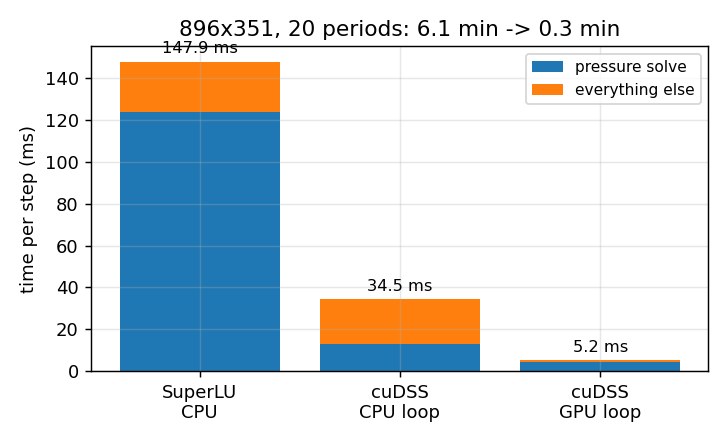

| | solve | everything else | per step | 20-period run at 896×351 |
|---|---|---|---|---|
| SuperLU, CPU | 124 ms | 23.9 ms | 147.9 ms | 6.1 min |
| cuDSS, CPU loop | 13.1 | 21.4 | 34.6 ms | 1.4 min |
| **cuDSS, GPU loop** | **4.4** | **0.8** | **5.2 ms** | **0.3 min** |

`--device gpu` keeps every field and operator on the card, so nothing crosses
the PCIe bus per step. Saved fields match the CPU run to ~1e-13, and the seiche
reproduces its CPU value exactly. Benchmarked against the alternatives on the
real pressure matrix (`solver_bench.py`): cuDSS is 25× faster per solve than
SuperLU at the same 3e-16 residual, while CuPy's CPU-factor/GPU-solve route is
30× *slower* and its single-precision variant loses too much accuracy to use.
A grid/operator cache removes the ~3 min of Octave grid generation per run.

## 5. Nonlinear advection

Flux form for buoyancy through the mimetic divergence; advective form for
momentum using **contravariant** velocities built from the grid metrics, so the
upwind direction is the one the flow takes through the cell. `--advscheme`
selects `upwind1` (first order, the accuracy of the 2021 one-sided operators),
`upwind2`, `minmod` or `vanleer`. `advect_test.py` checks the operators alone:
exact to 1e-15 on uniform flow, `u = x` and solid-body rotation, and second
order (1.83 → 1.97) on a smoothly stretched grid.

The lock release (`lock_test.ps1`) reproduces the configuration of the 2021
mimetic GCCOM — 0.8 × 0.0656 m, g' = 0.0224 m/s² — and resolves the
Kelvin–Helmholtz billows along the interface:

| scheme, 401×101 | front Fr | vs theory 0.7071 |
|---|---|---|
| upwind1 | 0.6741 | −4.7% |
| minmod | 0.6742 | −4.7% |
| upwind2 | **0.6991** | −1.1% |
| mimetic GCCOM, 2021 | 0.705 | −0.3% |

First-order advection costs 3.7% here; minmod lands on it because at a genuine
discontinuity the limiter reverts to first order. With `--advect full` the beam
of §3 runs steadily for 25 periods at 53.55° — the experiment §4.2.3 of the
2021 dissertation reports as failing. First-order advection alone does not
reproduce that failure here, which points at the other structural difference:
this solver advects only the perturbation and adds the background
stratification analytically, while the 2021 code advected the full temperature
field.

## 6. Nearshore internal bores in southern Monterey Bay

Target: Figure 10 of Walter, Woodson, Arthur, Fringer & Monismith (2012),
*J. Geophys. Res.* 117, C07017 — virtual thermistors at 2, 4 and 6 m above bed
at the 15 m isobath, where a shoaling internal tide arrives as cold bottom
surges. They separate a *canonical* shape (abrupt cold front, gradual warming)
from the *non-canonical* one they observed (sharp drop, continued slow cooling,
then an abrupt warm front), and attribute the difference to the internal
Iribarren number ξ = s/√(a/λ), reproducing both with SUNTANS on two idealised
bathymetries.

### Result: both regimes, from their own setup

Their two bathymetries, their stratification, the same mode-1 wave, at their
resolution (3981 × 81 cells: dx = 5 m, dz = 1 m at 81 m depth), six periods:

| | ξ ≈ 2, steep step | ξ ≈ 0.2, gentle slope |
|---|---|---|
| cooling (onset to minimum) | **4.6 h** | **0.17 h** |
| warming (minimum to ambient) | **1.2 h** | **6.3 h** |
| cooling / warming time | 3.7 → **non-canonical** | 0.03 → **canonical** |
| fastest cooling | 0.01–0.09 °C/min | 0.38–0.49 °C/min |
| 2 / 4 / 6 mab range | 1.06 / 0.70 / 0.37 °C | 1.39 / 1.40 / 1.40 °C |

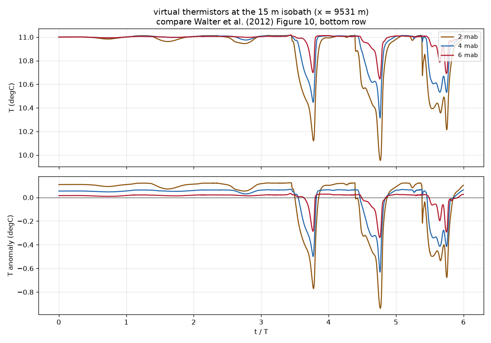

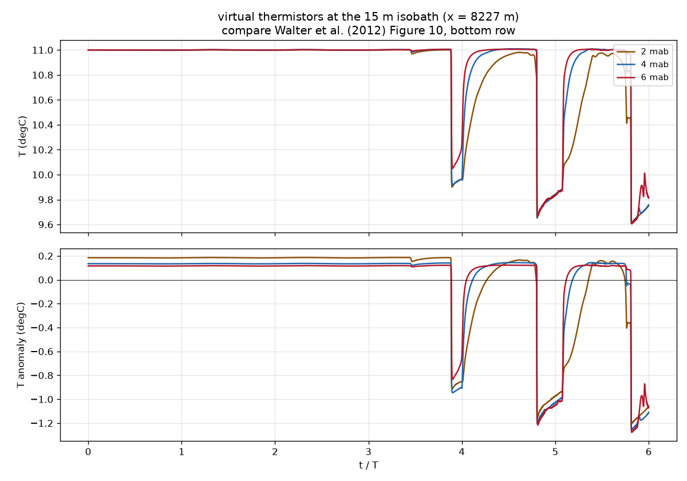


On the gentle slope the wave steepens into a bore offshore and arrives as a
cold front lasting minutes that fills the column, then relaxes over hours. On
the step the surge is bottom-trapped and cools the lower few metres for hours
before draining back. Only the slope differs between the two runs.

What still falls short: the non-canonical warm return takes about an hour
(fastest warming 0.03–0.04 °C/min) where theirs takes minutes (~0.2 °C/min).
These runs use a = 10 m; their two ξ values with their two slopes imply a
shared amplitude near 16 m, and a larger surge should drain back faster.
`events.py` makes the classification: per event, the time from onset to the
minimum and back. The shape is decided by where the time goes rather than by
the fastest rates, because a non-canonical event opens with a sharp drop too.

**Their setup**, recovered from the archived model files (`model_setup.m`,
`mb_modes.m`, `umode.mat`, `realdepth.mat`): stratification is a two-tanh fit
to the MBARI C1 cast of 1 April 2010, which `mry_N.txt` matches within 0.1 °C;
the bathymetries are analytic (`walter_bathy.py` writes them), the steep one
reproducing the real step along their bore path (13 → 42 m within one 200 m
sample); forcing is a mode-1 velocity profile at the offshore boundary, which
`--mode1force uw` imitates. Departures, all disclosed: convective adjustment
where N² < 0 (`--kconv 0.1`) and horizontal mixing (`--nuh 0.05 --kappah
0.05`), neither needed by SUNTANS's TVD scalar scheme; a 1.9 s step against
their 1 s; rotation at 36.8°N.

### On the measured transect

Before the archive turned up, the comparison ran on our own transect (measured
bathymetry extended offshore, `mry_setup.py --extend 20`). Two results there
stand: the wave converts from a linear tide to bottom-trapped surges as it
shoals, and the 2 mab magnitude converges with resolution.

| isobath | 80 m | 75 m | 70 m | 65 m | 60 m |
|---|---|---|---|---|---|
| range 2 mab / 6 mab | 0.87 | 1.04 | 1.11 | 1.28 | 1.68 |

| 15 m isobath, 2 mab | a = 3.7 m | a = 5.0 m |
|---|---|---|
| 768×151 | 0.202 °C | 0.409 °C |
| 3981×89 | 0.215 °C | 0.422 °C |

The shape never became non-canonical there — cooling/warming time ratios of
1.0–1.2 (roughly symmetric) with their stratification, 0.36 (canonical) with
the C1 cast of 18 May 2010 — through changes of resolution, rotation, mixing,
stratification and run-up room. The reason is the bathymetry: our transect
climbs from 50 m to 15 m over about a kilometre; theirs does it in ~400 m, so
at the mooring ours sits nearer ξ ≈ 1. These runs also used the bowed grid
described below, so their behaviour near the coast deserves a rerun.

### What it took

**A true sigma grid.** Two ridge-benchmark defaults wrecked the shelf grids.
Position-dependent stretching puts different node spacings on the top and
bottom curves, so TFI leans the columns: ~490 m of drift over 88 m of depth,
cells a median 64–83° off orthogonal. Uniform stretching (`--bt 0.01 --bb
0.01`) fixed the drift, but `--bulge 0.15` still bowed both side walls by
0.15 D0, which TFI blends into every column: ~20° near surface and bed, 80° at
the shallow end, while the drift diagnostic kept reporting a sigma grid.
`grid_view.py --skew` on the grid a run actually used is what showed it. With
`--bulge 0` the worst cell on the steep profile is 4.7°, the bottom slope itself
(`--sigma` builds the same grid from any TFI output).

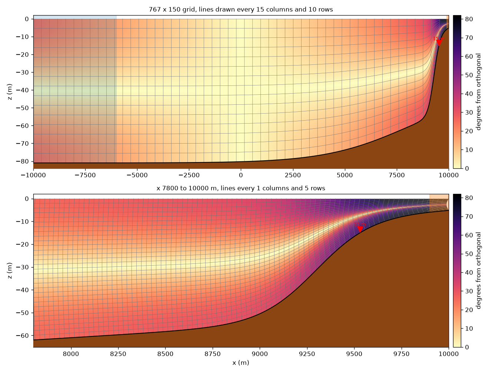

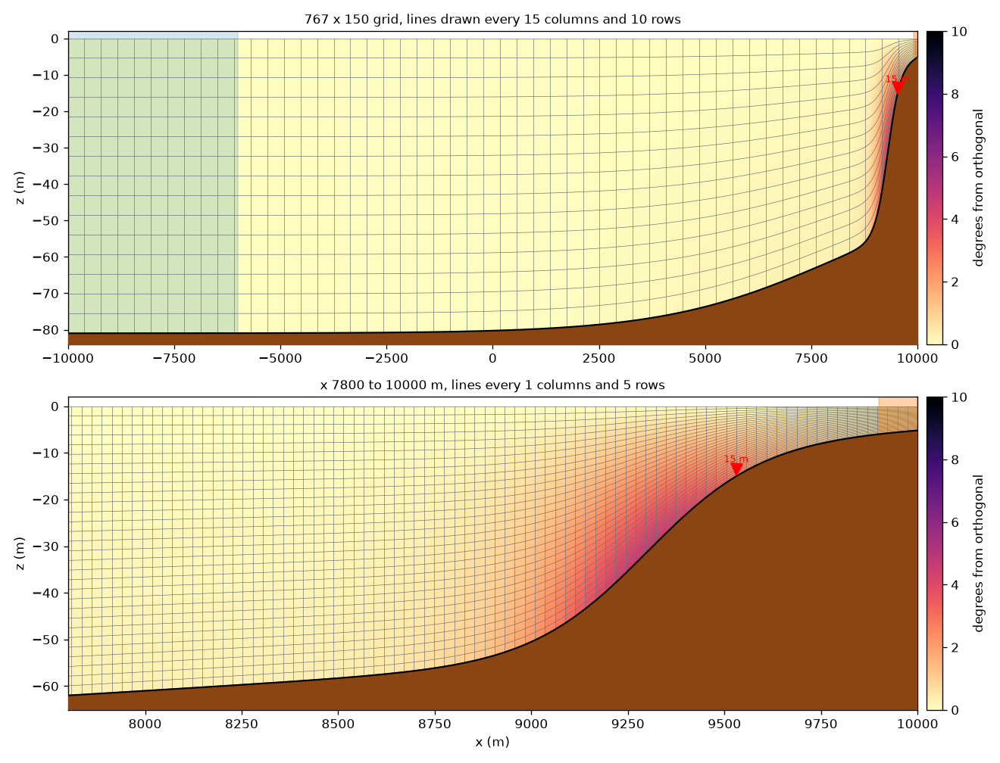

**The forcing at the right end.** The solver forces in the left sponge;
`mry_setup.py` now always puts the deep end there. Their profile, written
shallow-end first, was at first run mirrored, with the wave forced on top of
the slope.

**Resolution for steep fronts.** At 26 m cells both bores — the soliton-like
front on the gentle slope, the surge against the step — collapse to two cells
and the runs die; at 5 m they run to completion. `instab_anim.py` and
`--failframes`, which keep the last snapshots in memory and write them only on
divergence, are what showed where each failure began.

**Mixing where the physics needs it.** Overturns at the run-up grow at √|N²|;
implicit convective adjustment mixes them at the strengths ocean models use
(0.1–1 m²/s) for one tridiagonal solve per column. A two-cell oscillation in x
grows wherever the horizontal grid Reynolds number is ~10⁴; horizontal mixing
of 0.05 m²/s damps it without touching wavelengths of hundreds of metres.

**Measurement before interpretation.** Frames 47 minutes apart cannot show a
five-minute front, hence `--moor`, sampled every step. Several shapes read off
plots in this work turned out wrong once measured, in both directions; the
event metric was validated on synthetic records of known shape before it was
trusted, and corrected when the first criterion misclassified non-canonical
events.

Also learned the hard way: `alpha` scales as 1/dx² and must change with the
domain size; the shoreward sponge must not cover the slope or the mooring; and
explicit diffusion is limited by the thinnest cells, hence the metric-based
stability number and sub-cycling.

## MOLE fixes arising from this work

| issue | pull request | subject |
|---|---|---|
| csrc-sdsu/mole#453 | #466, merged | `GI13` index map — `grad3DCurv` did not converge on curvilinear grids |
| csrc-sdsu/mole#454 | #468, merged | warn when the grid handed to the curvilinear operators is left-handed |
| csrc-sdsu/mole#455 | #469, merged | `ttm` initial guess — elliptic grids came out folded |
| csrc-sdsu/mole#456 | #470 | orientation guard for 3-D, vanishing Jacobians, and the Legacy jacobians |

The 2-D results here use **stock MOLE**: none of those code paths is exercised
by `iwbcurv.py`. The buoyancy-coupling defect in §2 is not in a MOLE operator —
`interpol2D` and `interpolD2D` are each correct — but in how the pair is used
together at a sloping boundary.

## Reproducing

MOLE at upstream `main` with #466, #468 and #469 (the `mole` submodule), GNU Octave 8.4, Python
3.11–3.12, numpy, scipy, oct2py; optionally pypardiso, and cupy + nvmath-python
for the GPU path.

```powershell
git clone --recurse-submodules https://github.com/manuelvalera/gccom-mole-experiments.git
cd gccom-mole-experiments
$env:MOLE_SRC = "$PWD\mole\src\octave"        # src\octave, not src\matlab_octave
.\preflight_bulge.ps1                          # grid files must honour --bulge
.\validate.ps1                                 # sections A-C: ~15 min on a GPU
python centroid_track.py val-npz
```

| flag | purpose |
|---|---|
| `--ramp N` | bring the tide on smoothly over N periods |
| `--buoy energy` | energy-consistent buoyancy coupling (§2) |
| `--solver cudss --device gpu` | GPU factorization and an all-GPU time loop |
| `--solver pardiso` | multithreaded CPU solver (`MKL_NUM_THREADS=4` was fastest here) |
| `--u0 0 --noise A --probe` | free run and growth-rate report — any growth is an instability |
| `--cache DIR`, `--no-cache` | grid/operator cache |
| `--advect none\|scalar\|full`, `--advscheme` | nonlinear advection (§5) |
| `--lat`, `--fcor` | rotation |
| `--nu`, `--kappa`, `--nusub` | viscosity and diffusivity, sub-cycled against the thinnest cells |
| `--kconv` | convective adjustment where N² < 0, implicit per column (§6) |
| `--bt`, `--bb`, `--bulge` | grid stretching and side-wall bow; `--bt 0.01 --bb 0.01 --bulge 0` gives a true sigma grid, which the shelf needs |
| `--mode1 A`, `--lock G` | mode-1 boundary forcing; lock release |
| `--mode1force uwb\|uw` | what the forcing sponge imposes: velocity and buoyancy (default), or velocity only as SUNTANS did |
| `--sigma` | rebuild the TFI grid as an exact sigma grid on the same bed (equivalent to `--bulge 0 --bt 0.01 --bb 0.01`) |
| `--moor ISOBATH MAB...` | virtual mooring sampled every step |
| `--savestate T`, `--restart FILE` | checkpoint and resume (resumes by time, so `--spp` may change) |
| `--trace N`, `--checkevery N` | step-level diagnostics, including CFL and minimum N² |
| `--frames DIR` | snapshots for `animate.py` |

| study | scripts |
|---|---|
| everything, in order | `validate.ps1` |
| seiche verification | `seiche_study.ps1`, `seiche_alpha.ps1`, `seiche_report.py` |
| run length and the ramp | `time_test.ps1`, `ramp_test.ps1`, `time_compare.py` |
| beam measurement | `centroid_track.py`, `refit.py`, `curvature.py`, `crest_check.py` |
| the instability | `reproducer.ps1`, `ablate.ps1`, `instab_test.ps1` |
| similarity | `reflect_test.ps1` |
| performance | `solver_bench.py`, `speed_check.ps1`, `gpu_check.ps1`, `gpu_bench.ps1` |
| nonlinear operators | `advect_test.py`, `lock_test.ps1`, `beam_nonlinear.ps1` |
| mode-1 forcing | `mode1.py`, `phase_speed.py` |
| Monterey bores | `mry_setup.py`, `walter_bathy.py`, `ctd_profile.py`, `thermistors.py`, `events.py`, `instab_anim.py`, `grid_view.py`, `snapzoom.py` |
| animations | `animate.py`, `animate3.ps1`, `animate_web.ps1` |

Saved fields (`*.npz`) and the cache are not tracked; the scripts regenerate
them. Run logs are included. `STYLE.md` and `style_check.py` describe the
one-statement-per-line convention required for contributions to MOLE itself;
it is not enforced on the scripts in this repository.

## Citation

Cite the concept DOI, which always resolves to the latest version:
[10.5281/zenodo.22884121](https://doi.org/10.5281/zenodo.22884121). Individual
versions: v1.0.1 [10.5281/zenodo.22884885](https://doi.org/10.5281/zenodo.22884885).
See also `CITATION.cff`.

Please also cite Garcia et al. (2019) for the benchmark and the MOLE JOSS paper
(Corbino, Dumett & Castillo, 2024) for the operator library.

## License

GPL-3.0-or-later, matching MOLE.
